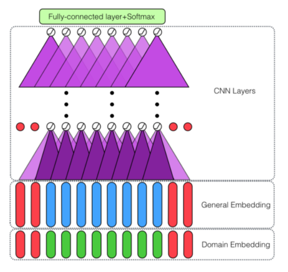

- Double Embeddings and CNN based Sequence Labeling for Aspect-Extraction -ACL 2018
    - [code](https://github.com/howardhsu/DE-CNN)
- Introduction
    - 词向量的质量会决定后面的层信息表示效果，大多方法或者使用通用词向量或者使用评论语料词向量
    - 然而实体抽取更需要领域的词向量，例如句子中的 _Its speed_  its可以用通用语料的词向量表示
    但speed在不同领域中时不一样的，在电脑领域就是指令运行速度，在更宽泛的领域可能是每秒走了多少米。所以加入领域的词向量时必要的
    - 利用CNN进行序列标注，通常使用卷积和池化操作来总结句子表示，输出和输入或者不会对齐
- Model
    - 模型主要包括两个词向量层，四个卷积层，一个所有词共享的全连接层，一个softmax层，y=(BIO)
    - 一个词向量时通用语料上的（上亿），领域词向量是较小的（例如笔记本就是笔记本这个小领域的，电子等其他领域都不要）
    - 由于数据小，两个词向量在训练中都固定不变
    - 卷积核大小是奇数，例如3，在每个位置都可以有左右一个词的视野。输出的序列也会与输入对齐。在第一层用不同大小的卷积核
    其余层用一种大小。Dropout在embedding层和每个relu层的后面
- 