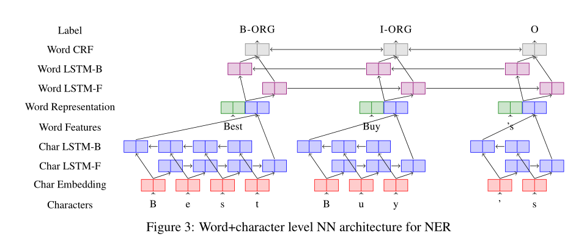

- A Survey on Recent Advances in Named Entity Recognition from Deep Learning models COLING2018
- A Survey on  Named Entity Recognition from Deep Learning models
- Design Challenges and Misconceptions in Neural Sequence Labeling
- NCRF++ An Open-source Neural Sequence Labeling Toolkit

- 2.3 Evaluation Metrics
    - Exact Match: 精确匹配。正确识别实体边界和类型。
        - True Positive(_TP_)：识别成实体，且类型正确
        - False Positive（_FP_）:识别成实体，但类型错误
        - False Negative(_FN_): 未识别出来
        - _P_ = _TP_/(_TP_+_FP_) ; _R_= _TP_/(_TP_+_FN_)
        - F-score = 2*(_P_*_R_)/(_P_+_R_)
        - 大部分NER系统包括多种实体类型。
            - Mac-F 分别计算每个实体类型的F值，然后进行平均。
            - Mic-F 把所有类型同等看待计算平均。受大类别的实体识别质量影响
    - Relaxed-Match Evaluation
        - 不管实体的边界，只要预测的边界和实际边界有overlap就可以。
- 2.4 传统方法
    - Rule-based：
        - 领域词典，句法词汇组合规则；同义词词典等
        - 当词典很完善的时候，效果好。由于领域规则和词典的不完整，通常会导致高准确率，低召回率。
        而且无法迁移到其他领域
    - Unsupervised
        - 聚类：词典，词汇模板和大规模语料的统计信息可以用来推断命名实体。根据上下文的相似性
        利用聚类的方法抽取
        - 抽取名词过滤IDF低的词。
    - Feature-based Supervised：
        - 模式化成多分类或序列标注问题，利用机器学习方法去识别相似的模板
        - 特征向量表示，将每一个词向量表示，每一维度代表特征
            - 词级别特征：形态学特征（数字，全部大写，数字和字母，是否包含下划线），词性特征，标点符号
            - 触发词，词缀特征: 例如以river未结尾就是地点。
            - 查表特征：维基百科，Dbpedia，词典（人名，地名）
            - 语料特征：局部句法，贡献
        - 模型：HMM，DecisionTree，MEM，SVM，CRF。
- NN
    - WordLevel
        - 以词粒度输入
    - Character Level
        - 以字符粒度输入
    - Character+Word level
        - 用词向量和卷积或LSTM的字符向量拼接作为词特征向量 后面接入Bi-LSTM， CRF
    - 融合特征的词表示
        - 词典，词汇相似度。词性标注。拼写特征，标点符号
        - 首字母大写，全部大写，大小写混合，全部小写
        - 依存分析，位置，
- 

