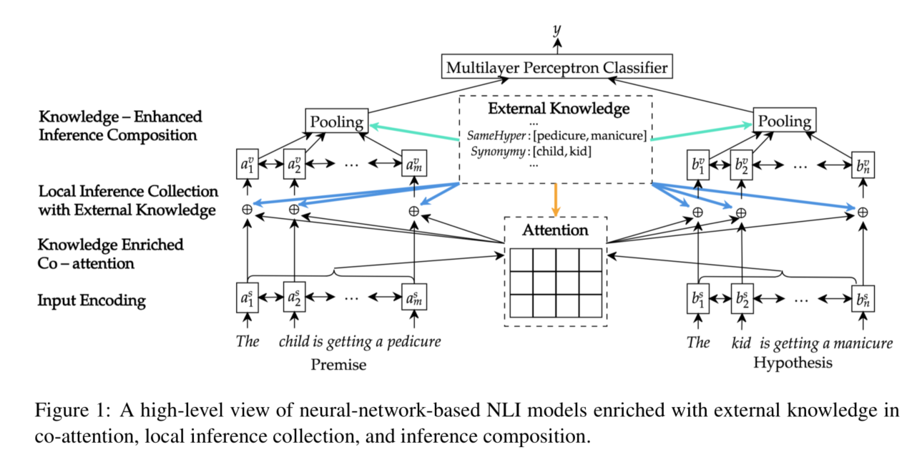

- ACL2018
- Introduction
    - 经典的神经网络方法都依靠于大量的标注数据来学习文本的推理知识。
    - 但如下文的例子， 如果训练数据没有wheat 和 corn其中的一个词，或者二者没有成对出现，那么模型很难预测两个句子的蕴含关系：
	p: A lady standing in a wheat field.
	h: A person standing in a corn field.
    - 本文提出利用外部知识辅助神经网络的方法来提高模型的效果（特别是在训练数据较少情况下）。
    在经典的ESIM模型的三个基础层上均加入了外部知识，作者在其提出的经典ESIM模型[1]基础上尝试了多种知识增强的方法，
    在大体深度模型框架不变的情况下，将原模型三个主要层只加入五种的WordNet语义关系，可以得到较好的实验结果。
    并通过详尽的实验分析，表明了深度模型融合外部知识的有效性和潜力。
- Related Work
    - 自然语言推理模型主要包含两种方法，一种基于句子编码模型，将两个句子利用相同的深度模型（LSTM，CNN）建模得到文本表示向量后利MLP进行分类。一种利用句子对之间的交互注意力建模内部匹配信息（Decomposable Att，ESIM）。ESIM在Decomposable attention基础上改进利用LSTM进行编码，本文在ESIM基础上进一步增加知识特征。
- 3 Models
    - 如下图，经典的NLI模型包括句子编码层，交叉注意力计算，局部（词汇）推理信息收集层，聚集组合推理信息层。
    本文模型在三个层分别加入了外部知识。

    - 3.1外部知识。主要加入的是推理相关知识。同义，反义，上下位关系（X is a kind of  Y）。上下位关系有助于识别蕴含，
    反义和共享上位词有助于识别歧义。
    - 3.2文本编码。首先利用双向LSTM对分别将句子对分别编码得到每个词的上下文隐层表示。
    - 3.3交叉注意力。然后在计算句子对交叉注意力来捕捉句子对的局部相关性的时候加入外部知识，这一层只为了识别词对是否包含推理关系。只要有语义关系，函数F的值就是1，其中λ是一个超参数。
    将该注意力分别进行row-wise和column-wise的softmax，这样通过该权重与Hypothesis的隐层表示，得到对齐Premise〖 a〗_i^(s )的上下文表示a_i^c。反之同理。
    - 3.4 局部推理信息收集。通过对比a_i^s¬¬ 和a_i^c，可以建模对齐后词对的推理关系。公式（7）的最后一项rij表示premise的第i个词与hypothesis第j个词的语义关系特征，同时利用对齐后的权重α通过外部知识得到词级别的推理信息。
    - 3.5 推理信息组合。这一层同样利用双向LSTM进行表示学习。通过学习局部推理向量am和bm来判断推理关系的类型和区分句子层面的显著推理关系。
    直观上，最后的推理结果会依赖于知识库中含有语义关系的词对。这一层经典的方法都是最大池化和平均池化来得到双向LSTM的表示。本文提出了一种基于外部知识库的加权池化方法，从而更聚焦于那些关键时间步的表示，如公式11，12。其中H是relu全连接，α与r与前面提到的相同，最后将三种池化方法拼接得到最终地表示。将句子对的表示输入到MLP中进行三分类。

- 4 Experiments
    - 外部知识的表示主要包括一下两种：词汇语义关系，五维向量（同义词，反义词，上位词，下位词，共享上位词）。
关系向量，通过关系向量TransE捕捉任意两个WordNet词中的关系。另外基于事实关系的知识图谱如Freebase不太适用于基于常识的NLI中。
实验数据集包括SNLI和MultiNLI。知识库采用WordNet3.0。
超参λ根据验证集选择[0.1-50]，WordNet训练TransE为20维。
- 5 Results
    - 在SNLI数据集上使用五种语义关系的外部知识的模型相比于ESIM提高了0.6%。进一步使用了更多的语义关系特征与TransE（原因可能是TransE对推理信息不敏感，WordNet五种语义关系特征已经包含TransE的信息）并没有提升。在MultiNLI有0.5%左右的提升。
该文的实验分析比较详尽，分析了训练数据规模较小的情况下，融入知识后的模型效果提升很大。同时分析了不同层知识的作用大小，公式7所代表的局部信息收集层作用最为明显。在数据较小时超参λ也要设置较大。另外该模型在跨领域的数据集上效果更明显，而且对反义的识别能力十分显著。右图例句表明了外部知识可以加强句子对核心词语（加粗字体）的关系识别能力。

- External Knowledge
    -  同义（synonymy），反义（antonymy）， 上位关系（hypernymy），下位关系（hyponymy）
        - 上下位关系 Hyponymy can be tested by substituting X and Y in the sentence ‘X is a kind of Y’。A screwdriver is a kind of tool
    -  hypernymy and hyponymy -> captural entailment
    -  antonymy and co-hyponymys(共享上位词) -> model contradiction
        - For example,  scissors, knife, and hammer are all co-hyponyms of one another and hyponyms of tool, but not hyponyms of one another: *‘A hammer is a type of knife’ is false.

#### Experiment Set-Up
- Representation of External Knowledge
- Lexical Semantic Relations
    - 五位向量
    - 同义词
        - [felicitous, good] = 1, [dog, wolf] = 0
    - 反义词
        - [wet, dry] = 1
    - 上位词
        - 1-n/8
        - [dog, canid] = 0.875, [canid, dog] = 0,
    - 下位词
        - 与上位词相反
        - [dog, canid] = 0, [canid, dog] = 0.875,
    - 共享上位词
        - [dog, wolf] = 1
- Relation Embeddings
    -  WN18, relation
    -  TransE

- Reference
    - [1] Qian Chen, Xiaodan Zhu, Zhen-Hua Ling, Si Wei, Hui Jiang, and Diana Inkpen. 2017a. Enhanced LSTM for natural language inference. In Proceedings of the 55th Annual Meeting of the Association for Computational Linguistics, ACL 2017, Vancouver, Canada, July 30 - August 4, Volume 1: Long Papers, pages 1657–1668.
- 
